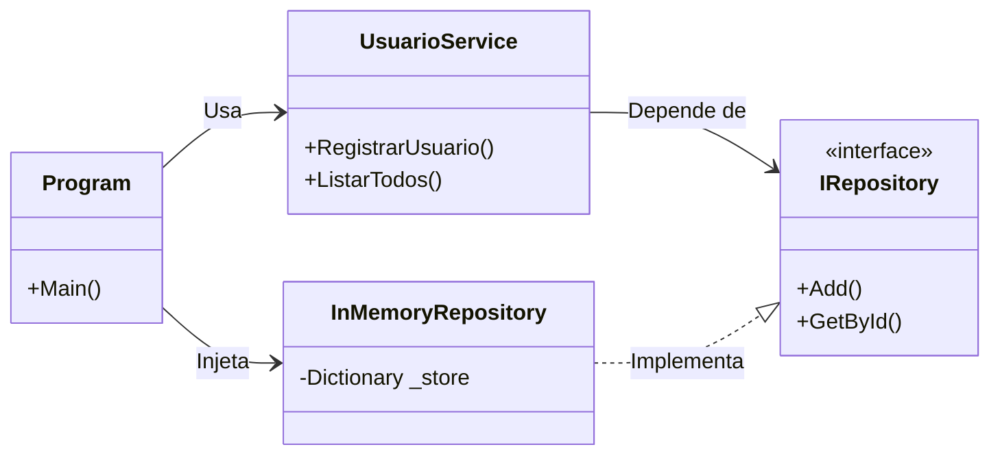

# Fase 5: Repository Pattern (InMemory)

## 📋 Sobre esta Fase
Nesta etapa, implementamos o padrão **Repository** para desacoplar a lógica de negócios da persistência de dados.

O objetivo principal é garantir que o **Service** (regras de negócio) dependa apenas de um contrato (Interface), desconhecendo se os dados estão salvos em memória, banco de dados ou arquivo. Isso facilita testes e futuras trocas de tecnologia.

---

## 📂 Estrutura do Projeto
Organizamos o código seguindo o princípio de separação de responsabilidades:

```text
src/fase-04-repository-inmemory/
├── Program.cs                  # Ponto de Entrada (Composition Root)
├── README.md                   # Documentação desta fase
├── Entities/
│   └── Usuario.cs              # Entidade de Domínio (Anêmica)
├── Interfaces/
│   ├── IRepository.cs          # Contrato Genérico de Acesso a Dados
│   └── IGeradorMensagem.cs     # Contrato da Lógica de Mensagem (Fase 4)
├── Repositories/
│   └── InMemoryRepository.cs   # Implementação Técnica (Dictionary)
└── Services/
    ├── UsuarioService.cs       # Regra de Domínio (Cadastro/Listagem)
    ├── Notificador.cs          # Serviço de Envio de Mensagem
    └── Geradores.cs            # Implementações de Estratégias de Mensagem
````

-----

## 📐 Arquitetura

O diagrama abaixo ilustra o fluxo de dependência invertida. O `UsuarioService` não conhece o `InMemoryRepository`; ele conhece apenas `IRepository`.



-----

## 💻 Snippets Principais

### 1\. O Contrato Genérico (`Interfaces/IRepository.cs`)

[cite\_start]Define as capacidades de acesso a dados, sem expor detalhes de implementação [cite: 23-31].

```csharp
public interface IRepository<T, TId>
{
    T Add(T entity);
    T? GetById(TId id);
    IReadOnlyList<T> ListAll();
    bool Update(T entity);
    bool Remove(TId id);
}
```

### 2\. A Implementação (`Repositories/InMemoryRepository.cs`)

[cite\_start]Usa um `Dictionary` para simular o banco de dados com performance O(1) e isolamento de estado [cite: 35-40].

```csharp
public sealed class InMemoryRepository<T, TId> : IRepository<T, TId> where TId : notnull
{
    private readonly Dictionary<TId, T> _store = new();
    private readonly Func<T, TId> _getId; // Estratégia de extração de ID

    public T Add(T entity)
    {
        var id = _getId(entity);
        _store[id] = entity;
        return entity;
    }
    // ... implementação dos demais métodos
}
```

### 3\. O Serviço de Domínio (`Services/UsuarioService.cs`)

[cite\_start]Consome o repositório via contrato para aplicar regras de negócio, sem tocar na coleção diretamente [cite: 78-89].

```csharp
public class UsuarioService
{
    private readonly IRepository<Usuario, int> _repo;

    public UsuarioService(IRepository<Usuario, int> repo)
    {
        _repo = repo; // Injeção de Dependência via Construtor
    }

    public void RegistrarUsuario(int id, string nome, string tipo)
    {
        // Regras de validação poderiam vir aqui
        _repo.Add(new Usuario(id, nome, tipo));
    }
}
```

### 4\. Injeção de Dependência Manual (`Program.cs`)

[cite\_start]O ponto único onde as peças são conectadas (Composition Root) [cite: 92-100].

```csharp
// 1. Criar o Repositório (Detalhe de Infraestrutura)
var repo = new InMemoryRepository<Usuario, int>(u => u.Id);

// 2. Criar o Serviço injetando o Repositório (Injeção de Dependência)
var service = new UsuarioService(repo);

// 3. Usar o Serviço (Agnóstico à persistência)
service.RegistrarUsuario(1, "Luciemen", "Premium");
```

-----

## 🚀 Como Executar

**Executar a Aplicação:**

```bash
dotnet run --project src/fase-04-repository-inmemory
```

**Executar os Testes:**

```bash
dotnet test tests/Fase04.Tests
```

```
```